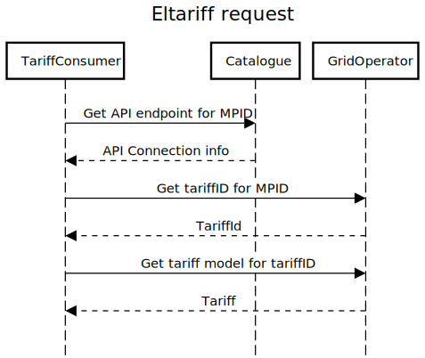

# Eltariff-API
_Specification for an API for Electricity Grid Tariffs in Sweden._

__Please note that the provision of data in this API is in a development phase. It is likely not legally binding, used at your own risk, and does not entail any obligations for the grid operators unless otherwise stated. For more information, contact the respective grid company.__
# Documentation

The Eltariff API is based on electricity grid operators publishing their tariffs according to a shared [API specification](specification/gridtariffapi.json)
and registering their implementation with a shared catalogue service, whose API specification is available [here](specification/catalogueapi.json).

Anyone wishing to retrieve tariff information should start by calling the catalogue service with one or more facility IDs (anläggnings-id) to get information on where the tariff data can be retrieved for each respective facility ID.

# Contribute
Run the following commands to set up your dev environment

    npm install
    bash scripts/install-hooks.sh

The pre-commit hook makes sure that any generated files within `specification/versions/` are not changed manually. The versioned bundle files are created in GitHub Actions by manually running the "Bundle and store current API version" action.

## Build
    dotnet build src/ControllerGenerator

This will create a C# controller based on the OpenAPI specification `specification/gridtariffapi.json`. The `ExampleController` project implements the generated controller.

    dotnet run --project src/SwaggerUI

Run the `SwaggerUI` project with the above command, which will use the `ExampleController` as a server so that you can test the requests.
Access the Swagger UI by going to http://localhost:5000/swagger.
