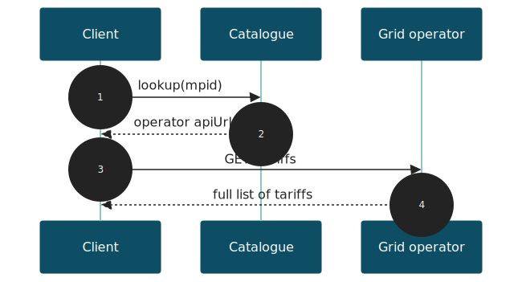

<!-- _class: lead -->
<!-- _paginate: false -->

# ElTariffKatalog

### The discovery layer of Eltariff-API

Eddie Bassey Olsson · 2026-06-18

<!--
Speaker notes:
This is a short talk about the catalogue service in the Eltariff-API project.
Heads-up for the audience: the API is still in a development phase — not legally
binding, used at your own risk, no obligations for grid operators unless stated
(README disclaimer).
-->

---

## The problem

- Sweden is introducing **time-differentiated power tariffs**
- The project's **original goal**: better support for **smart EV charging** and load shifting
- But there are **many grid operators**, each publishing **their own** tariffs
  - A deliberate **design choice** in this project

> Given one facility, *where* do I fetch the right tariff data?

<!--
Smart charging was the original motivation for this project — making tariff data
machine-readable so charging can shift to cheaper / lower-load hours.
Letting each operator publish its own tariffs (rather than a central store) was a
deliberate design choice. Without a shared index, a client would have to know every
operator's API by heart — that discovery problem is exactly what the catalogue solves.
-->

---

## The ecosystem — three parts

| Part | Role |
|------|------|
| **Grid Tariff API** | Each grid operator (DSO) publishes *its own* tariffs |
| **Catalogue API** | Central registry of *where* each operator's API lives |
| **Clients** | Consumers — apps, services, aggregators |

**The catalogue is the entry point.** Clients call it *first*.

Used **primarily during onboarding** of a new user — not on every tariff fetch.

<!--
Source: the onboarding doc, "Översikt av systemet". Three independent components;
the catalogue is the glue that ties operators and clients together.
The lookup typically happens once, when a new user/facility is set up; the result
is then reused, so the catalogue is not hit on every tariff request.
-->

---

## What the catalogue is

**ElTariffKatalog** — a central registry, i.e. a **"phone book"**

- Maps **18-digit metering-point ID ranges** → an operator's Grid Tariff API URL
- Holds **no tariff data itself** — only pointers
- Served at **`https://eltariff.se`**

<!--
Key mental model: the catalogue does NOT store tariffs. It stores "for these
facility IDs, go talk to this operator's API at this URL". Lightweight by design.
The entry format echoes Norway's static gridcompany-mapping file (on GitHub), but
Norway has no catalogue *service* — this catalogue is a new Swedish addition.
-->

---

## How it works — the lookup flow

1. Client has a facility's **metering-point ID (anläggnings-id)**
2. Calls catalogue **`lookup`** → gets the operator's **`apiUrl`**
3. Calls that operator's **`/tariffs`** → gets the actual tariff data



<!--
Walk the diagram left to right. The catalogue is a one-time redirection step;
after that the client talks directly to the operator. This keeps the catalogue
small and the tariff data authoritative at the source.
-->

---

## Two sub-services

<div class="columns">

**`register-service`**
*write · authenticated*

Operators onboard and maintain their own entries.

**`supplier-service`**
*read · public*

Clients look up where to fetch tariffs.

</div>

- **Register** requires **OAuth2 client-credentials** (scope `register:write`, token at `id.deplide.org`) or a bearer **JWT**
- **Lookup** is **public** — no auth
- **`409 CONFLICT`** guards against **overlapping MPID ranges**

<!--
Defined as OpenAPI tags in catalogueapi.json. Clean split: writing requires auth,
reading is open so any client can discover operators freely.
The conflict check is a real domain constraint: two operators must not both claim the
same facility ID. Auth details in AUTHENTICATION.md / catalogueapi.json.
-->

---

## Endpoints

| Method & path | Purpose |
|---|---|
| `POST /tariffcatalogue/register` | Register API info for an MPID range |
| `PUT /tariffcatalogue/register` | Update an entry |
| `DELETE /tariffcatalogue/register/{supplierEntryId}` | Remove an entry |
| `POST /tariffcatalogue/lookup` | Bulk lookup (many MPIDs) |
| `GET /tariffcatalogue/lookup/{mpid}` | Single lookup |
| `GET /tariffcatalogue/all` | Get the entire catalogue (all entries) |

<!--
The three register endpoints are the authenticated write side; the lookup/all
endpoints are the public read side. /all returns the full catalogue.
-->

---

## The data model

```json
// SupplierEntry — one catalogue record
{
  "id": "uuid",
  "meteringPointIdFrom": "730000000000000001",
  "meteringPointIdTo":   "730000000000000999",
  "companyName": "Example Grid AB",
  "companyOrgNo": "556000-0000",
  "apiUrl": "https://api.example.se/gridtariff",
  "userDocUrlOrEmail": "support@example.se"
}
```

`EntryMapping`: `meteringPointId → entryId` · MPID pattern `^[0-9]{18}$`

<!--
SupplierEntry covers a *range* of metering-point IDs, not one. Lookup returns
EntryMappings so the client knows which entry serves each requested ID.
Source: catalogue.schema.json.
-->

---

## Status & timeline

- **1 Mar 2025** — Göteborg Energi & Tekniska verken first to publish
- **Spring 2025** — RISE status website launches
- Goal: **all grid operators** publishing their tariffs in the API

Run by **RISE**, funded by **Energimyndigheten/FFI**. The **Tariff API** builds on a Norwegian solution; the **catalogue service is new** — Norway has only a static file of entries on GitHub.

Grid operators: Vattenfall, E.ON, Kraftringen, Halmstad, Jämtkraft and more.
Beyond DSOs: **Volvo Cars, Volvo Trucks, Einride, Tibber, Power Circle, Energiföretagen** (Swedenergy).

<!--
Source: SUMMARY.md. Important nuance: only the Grid Tariff API derives from the
Norwegian solution. Norway has no catalogue service at all — just a static
gridcompany-mapping file on GitHub. The catalogue here is a new Swedish addition.
Good slide to convey momentum — real operators live, broad participation.
-->

---

## What's still evolving

**Known caveats** — API is in a **development phase** (feedback welcome). Conformance flags vs the Swedish API profile: verb-named resources, `entryMapping` should be plural, errors lack a body schema.

**Under discussion / requested**

- **Geographic lookup** — find catalogue entries by **position**, so digital service providers (e.g. for charging stations) need no MPID
- **Distributed catalogue** — integrate the catalogue API into the **Tariff API**, making the catalogue distributed too

<!--
First half: known, tracked items in CONFORMANCE_REPORT.md — active, self-aware work.
Second half: forward-looking, community-requested directions.
- Geographic lookup: a charging-station service knows *where* it is, not the facility's
  MPID — being able to query by position would remove that friction.
- Distributed catalogue: folding the catalogue endpoints into each operator's Tariff API
  would decentralise the registry instead of relying on one central service.
-->

---

<!-- _class: lead -->

## Takeaways

**The catalogue is the phone book of Eltariff-API:**
look it up by facility ID → get the operator's API → fetch tariffs.

- GitHub: `https://github.com/RI-SE/Eltariff-API`
- Contact: `niklas.thidevall@ri.se`
- Technical contact: `eddie.bassey.olsson@ri.se`

### Thank you · Questions?
